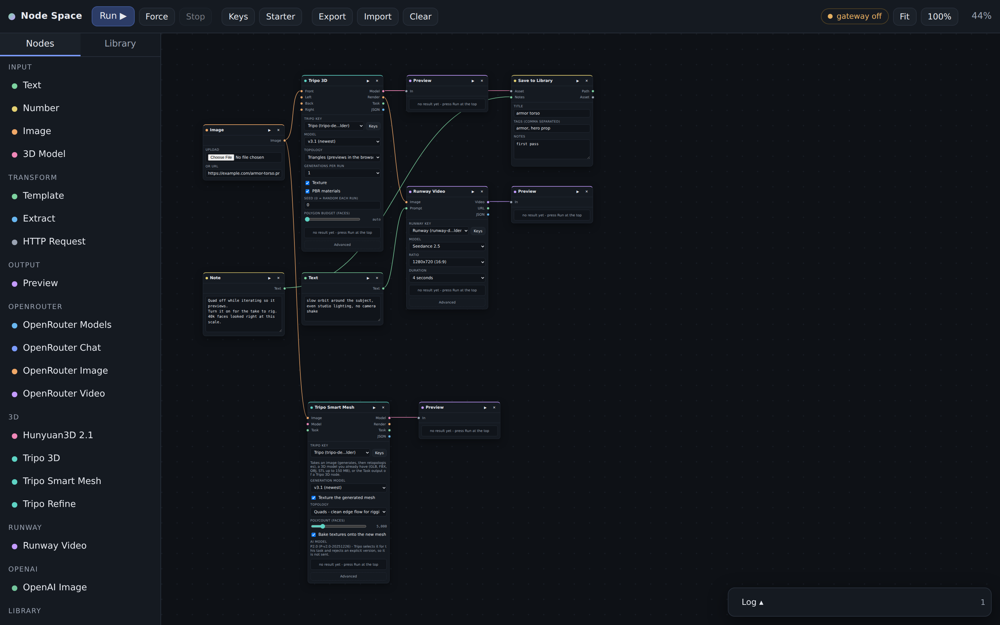

# Node Space

A node-based canvas that runs in the browser with no build step. You drop nodes
on a canvas, wire outputs into inputs, and hit Run to execute the graph. The
first provider wired up is **OpenRouter**, including a video node aimed at
**Seedance**.



## Run it

Opening `index.html` by double-clicking will **not** work: browsers refuse to
load ES modules over `file://`, so the folder has to be served.

**On a Mac, double-click `start.command` in Finder.** It serves the folder and
opens your browser. Close the Terminal window it opens to stop the server.

From a terminal, either of these does the same thing:

```bash
npm run dev            # node scripts/serve.mjs --open
python3 -m http.server 8080    # then open http://localhost:8080
```

`start.command` uses python3 if it is there and falls back to node. macOS ships
neither by default; if it finds neither it tells you to run
`xcode-select --install` (one time, gives you python3) or install Node.

Any other static server works too (`npx serve`, `caddy file-server`, nginx).

### Hosting it on GitHub Pages

The app is plain static files with relative paths, so it works unchanged from a
project subpath. In the repository: **Settings → Pages → Source: Deploy from a
branch**, pick this branch and the `/ (root)` folder. The site lands at
`https://<user>.github.io/<repo>/` a minute or so later.

Your API key is not part of any of this. It lives in the `localStorage` of
whichever browser you typed it into, so visitors to a public deployment see an
empty Keys panel and must supply their own. Note that browser storage is scoped
to the *origin* (`https://<user>.github.io`), not the repo path, so every Pages
site under that account shares one storage area.

The `localhost` proxy fallback does not pair well with an HTTPS Pages origin:
Chrome permits requests to `http://localhost`, Safari blocks them. Run the app
locally if you need the proxy.

## Add your API key

1. Click **Keys** in the toolbar.
2. Paste an OpenRouter key, give it a label, save.
3. Pick that key in the *API key* dropdown on any OpenRouter node.

Keys are stored in **this browser's `localStorage`** and nowhere else. They are
deliberately left out of saved and exported graphs, so a `.json` you share
carries the wiring but not the secret.

> **Rotate any key you have pasted into a chat window, a screenshot, or a
> commit.** Treat it as public from that moment on:
> <https://openrouter.ai/settings/keys>

If you would rather the key never touch the browser, run the bundled proxy
instead (see [Keeping the key server-side](#keeping-the-key-server-side)).

## Using the canvas

| Action | How |
| --- | --- |
| Add a node | Click it in the left palette, or double-click empty canvas for a searchable menu |
| Connect | Drag from an output dot (right side) to an input dot (left side) |
| Disconnect | Drag off a connected input, or double-click the wire |
| Delete | Select a node or wire, press `Delete`; or use the `✕` on the node header |
| Move / zoom | Drag empty canvas to pan, scroll to zoom, **Fit** to frame everything |
| Run everything | **Run ▶** or `Ctrl`/`Cmd` + `Enter` |
| Run one branch | The `▶` on a node header — runs just that node and its upstream |
| Force re-run | **Force** ignores cached results |

Results are cached per node against its inputs and settings, so re-running only
repeats the work that actually changed. Editing a field invalidates that node
and everything downstream of it.

Graphs autosave to `localStorage` on every change; **Export** / **Import** move
them between browsers.

## Nodes

**Input** — `Text` (prompts and any string), `Number`, `Image` (file upload kept
in memory as a data URL, or a pasted URL).

**Transform**
- `Template` — compose text from up to three inputs with `{{a}} {{b}} {{c}}`.
- `Extract` — read a path out of a JSON payload (`choices[0].message.content`),
  or auto-find the first video/image URL anywhere in it.
- `HTTP Request` — the generic plug for **any** REST API: method, URL, auth
  header, extra headers, and a JSON body template with `{{input}}` / `{{image}}`
  substituted from its ports.

**OpenRouter**
- `OpenRouter Models` — lists live model slugs, with a filter box. Use it to
  find the exact id to type into a model field.
- `OpenRouter Chat` — any text model; attach an image for vision models.
- `OpenRouter Image` — image-output models via `/chat/completions` with the
  image modality.
- `Video (Seedance)` — see below.

**Output** — `Preview` renders whatever it is handed: text, JSON, an image, or a
playable video.

## The Seedance video node

Video generation is asynchronous and the exact endpoint and payload differ by
provider and change over time, so this node is **request-spec driven** rather
than hard-coded. It submits a job, then polls until a video URL appears.

Fields:

- **Model** — defaults to `bytedance/seedance-2.5`. Hit the `↻` button beside it
  to pull the live model list into the field's autocomplete; matching `seedance`
  slugs are printed in the Log. If the default slug 404s, the real one is in
  that list (or on <https://openrouter.ai/models>).
- **Call style**
  - *Generation endpoint (submit + poll)* — `POST /videos` with
    `{model, prompt, duration, resolution, aspect_ratio, image?}`, then polls
    `GET /videos/{id}` until it is done. This is the default.
  - *Chat completions* — `POST /chat/completions` with
    `modalities: ["video","text"]`, for models exposed through the chat surface.
  - *Custom body* — you write the JSON, with `{{prompt}}`, `{{image}}` and
    `{{duration}}` placeholders.
- **Seconds / Resolution / Aspect** — sent as `duration`, `resolution`,
  `aspect_ratio`.
- **Advanced** — submit path, poll path (`{id}` is substituted), poll interval,
  timeout, and Base URL.

Wire an `Image` node into **First frame** for image-to-video.

**If the response shape is not what the node expects**, it says so and still
emits the raw payload on its `JSON` port. Wire that into a `Preview` to see what
came back, then either adjust the paths under **Advanced** or pull the URL out
with an `Extract` node (`Find video URL` mode handles most shapes). The three
outputs are `Video` (plays in a Preview), `URL` (plain text), and `JSON` (the
whole payload).

## Plugging in your other APIs

Two options, in increasing order of effort:

1. **`HTTP Request` node** — no code. Set the URL, pick a key (stored the same
   way as the OpenRouter one), write a body template, and pull fields out of the
   response with `Extract`.
2. **A real node type** — add a definition in `src/nodes/`. A node is plain data
   plus an async `run()`:

```js
registry.register({
  type: 'my-api',
  title: 'My API',
  category: 'Custom',
  accent: '#7dd3a0',
  inputs: [{ id: 'prompt', label: 'Prompt', type: 'text', required: true }],
  outputs: [{ id: 'text', label: 'Text', type: 'text' }],
  fields: [
    { id: 'credential', kind: 'credential', label: 'API key' },
    { id: 'endpoint', kind: 'text', label: 'Endpoint' },
  ],
  defaults: { credential: '', endpoint: 'https://api.example.com/v1/run' },
  async run({ inputs, data, keystore, signal, log }) {
    const key = keystore.require(data.credential);
    const res = await fetch(data.endpoint, {
      method: 'POST',
      headers: { 'Content-Type': 'application/json', Authorization: `Bearer ${key}` },
      body: JSON.stringify({ prompt: inputs.prompt }),
      signal,
    });
    const payload = await res.json();
    log('done');
    return { text: payload.output };
  },
});
```

Register it from `src/main.js` and it shows up in the palette. Field kinds
available to you: `text`, `textarea`, `number`, `select`, `checkbox`, `file`,
`credential`, `model`, `preview`, `info` — plus `advanced: true` to tuck a field
behind the Advanced toggle and `showWhen` / `hideWhen` for conditional fields.

## Keeping the key server-side

The browser calls OpenRouter directly. If the browser blocks that as
cross-origin, or you would rather the key lived in an env var than in
`localStorage`:

```bash
OPENROUTER_API_KEY=sk-or-v1-... npm run proxy
```

Then set **Base URL** (under Advanced on any OpenRouter node) to
`http://localhost:8787/api/v1`. The proxy forwards everything to
`https://openrouter.ai` and injects the key when the request has no
`Authorization` header of its own. Do not expose it on a public interface — it
is a development convenience with no auth of its own.

## Tests

```bash
npm install     # playwright, dev-only
npm test        # serves the app + a mock OpenRouter API, drives it in Chromium
node tests/screenshot.mjs   # refreshes docs/screenshot.png
```

The smoke test covers booting, palette insertion, drag-to-connect, port type
and cycle rejection, a full submit-and-poll video run against the mock API, the
missing-key error path, secret-free export, autosave restore, and the quick-add
menu — 20 assertions, no network access required.

## Layout

```
index.html            shell: toolbar, palette, canvas, log
.nojekyll             tells GitHub Pages to serve the files as-is
start.command         double-click launcher for macOS
styles.css            all styling (dark, CSS custom properties)
src/core/             store (graph state), engine (topo run + cache), types
src/nodes/            registry + node definitions (core, openrouter)
src/providers/        openrouter client, credential keystore
src/ui/               canvas/wires, node cards, palette, keys modal, log
src/util/             dom helpers, response extraction + templating
scripts/serve.mjs     local dev server
scripts/proxy.mjs     optional local proxy
tests/                headless smoke test and screenshot tool
```

## Known limits

- One edge per input (fan-out from an output is unlimited).
- No subgraphs, loops or batching yet — the engine runs each node once per run.
- Streaming responses are not surfaced; chat calls resolve as a whole.
